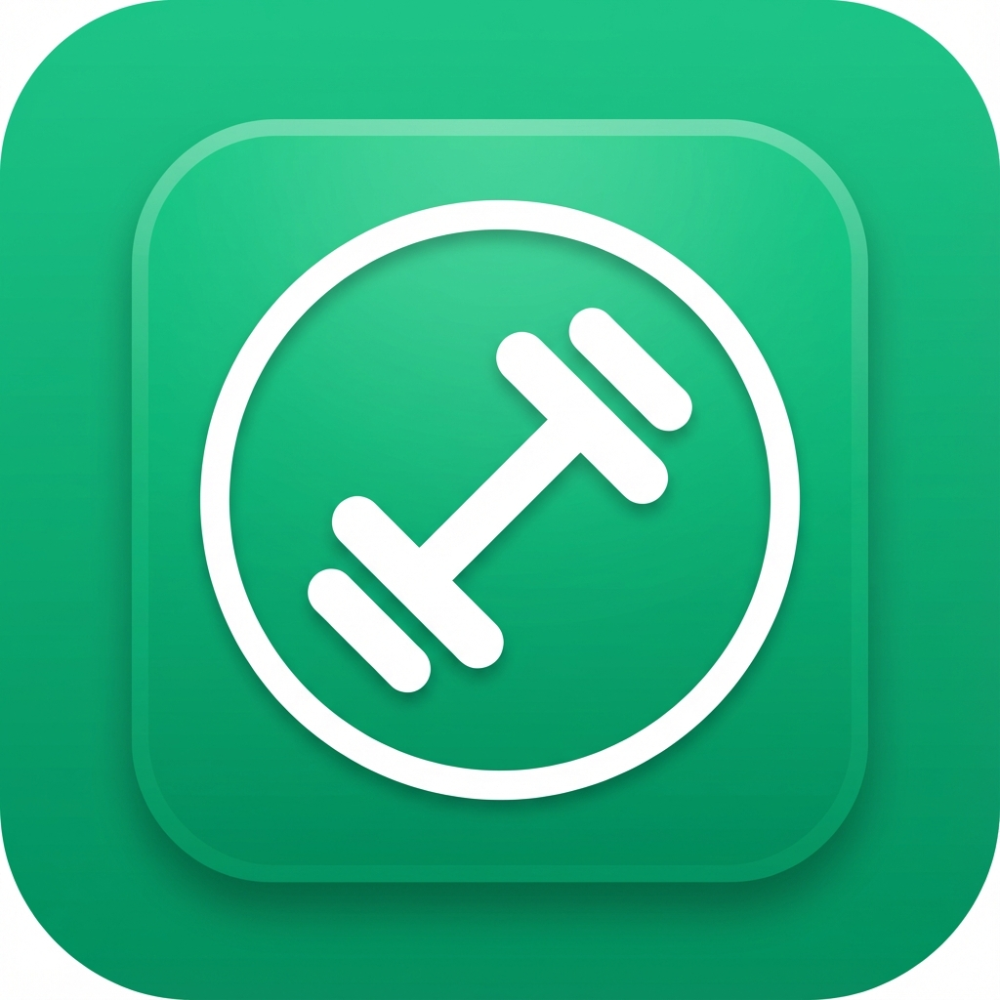

# Runli - Fitness Tracker PWA

A comprehensive fitness tracking Progressive Web App built with React, featuring workout tracking, habit monitoring, diet planning, and more.



## 🌟 Features

### 📊 Dashboard
- Daily progress tracking (water, calories, protein, gym attendance)
- Weekly streak visualization
- Monthly activity calendar
- AI-powered daily insights
- Quick access to all features

### 🏋️ Gym Mode
- Dynamic workout split based on training frequency (2-7 days/week)
- Exercise tracking with weight and RPE logging
- Workout timer and rest timer (30s - 150s)
- Fullscreen plank timer (30s - 5min)
- Plate calculator for barbell exercises
- Exercise form videos

### 🎯 Habit Tracker
- Create custom habits
- Track daily completion
- Streak calculations
- Visual progress indicators
- Toast notifications for achievements

### 🍽️ Diet Plan Generator
- AI-powered meal plans
- Budget-based filtering (₹1k - ₹50k)
- Dietary preferences (Veg/Non-Veg/Vegan)
- Meal variety optimization
- Custom meal planning

### 📈 Plan Page
- Personalized workout split generation
- BMI and fitness metrics
- Weekly workout schedule
- Calorie and protein recommendations

### 🛒 Shopping
- Fitness product catalog
- Category filtering
- Price sorting
- Product details and ratings

### 🎥 Video Dashboard
- Exercise form videos
- Common mistakes videos
- Organized by muscle group
- Adjustable video player

## 📱 Progressive Web App

Runli is optimized as a PWA and can be installed on mobile devices:

### Installation

**Android (Chrome):**
1. Open the app in Chrome
2. Tap menu (⋮) → "Add to Home screen"
3. Confirm installation

**iOS (Safari):**
1. Open the app in Safari
2. Tap Share → "Add to Home Screen"
3. Confirm installation

### PWA Features
- ✅ Fullscreen app experience
- ✅ Offline-ready (with service worker)
- ✅ App icon on home screen
- ✅ Native app feel
- ✅ Fast loading
- ✅ Mobile-optimized layouts

## 🚀 Tech Stack

### Frontend
- **React** - UI framework
- **React Router** - Navigation
- **Lucide React** - Icons
- **PapaParse** - CSV parsing
- **React Select** - Enhanced select inputs

### Backend
- **Node.js** - Runtime
- **Express** - Web framework
- **MongoDB** - Database
- **Mongoose** - ODM
- **JWT** - Authentication
- **Google Gemini AI** - AI-powered features

### Build Tools
- **Vite** - Build tool and dev server
- **ESLint** - Code linting
- **PostCSS** - CSS processing

## 🛠️ Installation & Setup

### Prerequisites
- Node.js (v16 or higher)
- MongoDB (local or Atlas)
- npm or yarn

### Clone Repository
```bash
git clone https://github.com/yourusername/runli.git
cd runli
```

### Install Dependencies
```bash
npm install
```

### Environment Variables
Create a `.env` file in the root directory:
```env
MONGODB_URI=your_mongodb_connection_string
JWT_SECRET=your_jwt_secret_key
GEMINI_API_KEY=your_google_gemini_api_key
PORT=5001
```

### Run Development Servers

**Backend:**
```bash
npm run server
```

**Frontend:**
```bash
npm run dev
```

The app will be available at `http://localhost:5173`

### Build for Production
```bash
npm run build
```

## 📁 Project Structure

```
runli/
├── public/              # Static assets
│   ├── manifest.json    # PWA manifest
│   ├── icon-192.png     # App icon (192x192)
│   └── icon-512.png     # App icon (512x512)
├── server/              # Backend code
│   ├── models/          # MongoDB models
│   ├── routes/          # API routes
│   └── server.js        # Express server
├── src/                 # Frontend code
│   ├── components/      # React components
│   ├── context/         # React context
│   ├── pages/           # Page components
│   ├── services/        # API services
│   ├── utils/           # Utility functions
│   ├── App.jsx          # Main app component
│   └── main.jsx         # Entry point
├── .gitignore
├── package.json
├── vite.config.js
└── README.md
```

## 🎨 Design Features

- **Dark Theme** - Easy on the eyes
- **Emerald Green Accents** - Modern color scheme
- **Glassmorphism** - Premium UI effects
- **Responsive Design** - Works on all devices
- **Touch-Optimized** - 44px minimum touch targets
- **Smooth Animations** - Polished user experience

## 📊 Data Persistence

All user data is automatically saved to MongoDB:
- Daily progress (water, calories, protein, gym)
- Habit completions and streaks
- Workout history and exercise logs
- Diet plans and meal selections
- User profile and preferences

### Daily Reset
- Trackers reset automatically at midnight
- Historical data preserved in database
- Streaks calculated correctly

## 🔒 Authentication

- JWT-based authentication
- Secure password hashing
- Protected API routes
- User session management

## 🌐 API Endpoints

### Authentication
- `POST /api/auth/signup` - User registration
- `POST /api/auth/login` - User login

### User
- `GET /api/user/profile` - Get user profile
- `PUT /api/user/profile` - Update user profile

### Progress
- `GET /api/progress/:date` - Get daily progress
- `POST /api/progress/:date` - Update daily progress
- `GET /api/progress/range/:startDate/:endDate` - Get progress range

### Habits
- `GET /api/habits` - Get all habits
- `POST /api/habits` - Create habit
- `PUT /api/habits/:id` - Update habit
- `DELETE /api/habits/:id` - Delete habit
- `POST /api/habits/:id/log` - Log habit completion

### Diet
- `GET /api/diet` - Get diet plans
- `POST /api/diet` - Create diet plan

### AI
- `GET /api/ai/insight` - Get daily AI insight

## 🤝 Contributing

Contributions are welcome! Please feel free to submit a Pull Request.

## 📄 License

This project is licensed under the MIT License.

## 👤 Author

**Your Name**
- GitHub: [@yourusername](https://github.com/yourusername)

## 🙏 Acknowledgments

- Exercise videos from YouTube
- Icons from Lucide React
- AI powered by Google Gemini
- Fonts from Google Fonts

## 📞 Support

For support, email your@email.com or open an issue on GitHub.

---

**Made with ❤️ for fitness enthusiasts**
