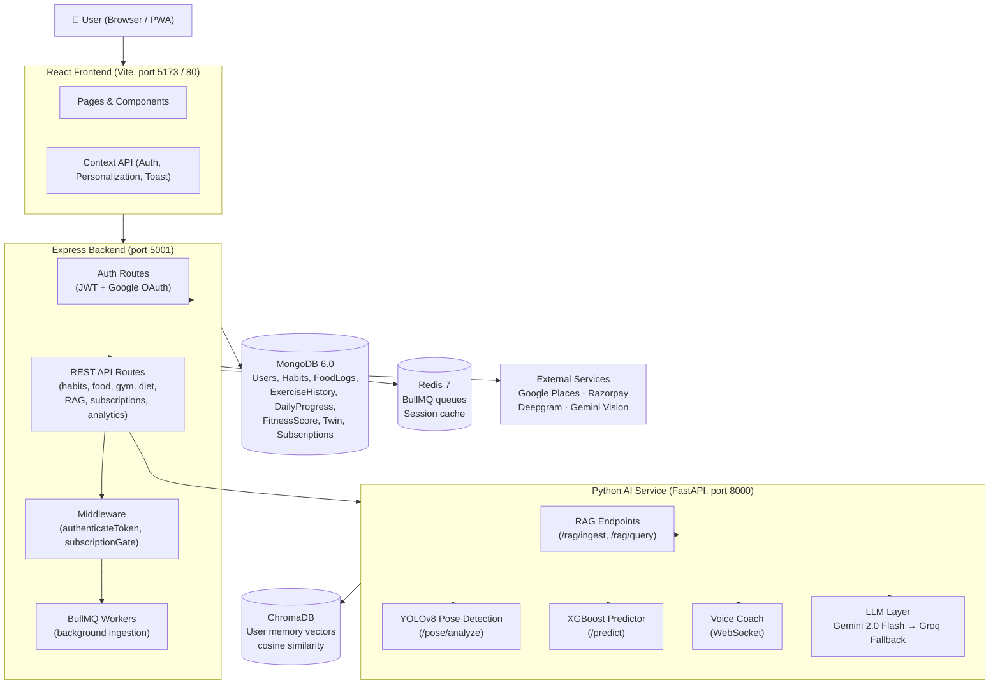

# Runli

> **Your AI-powered fitness companion** — personalized workout tracking, intelligent diet planning, real-time pose analysis, and a RAG-augmented coach that remembers your history.

[](https://nodejs.org)
[](https://react.dev)
[](https://fastapi.tiangolo.com)
[](https://www.mongodb.com)
[](https://docs.docker.com/compose)
[](https://opensource.org/licenses/ISC)

---

## Overview

Runli is a **full-stack fitness lifestyle application** built on the MERN stack with a dedicated Python AI microservice. It goes beyond simple habit logging by combining:

- **Real-time computer vision** — a YOLOv8 pose-detection model counts your reps and scores your form live in the browser
- **RAG-augmented AI coaching** — a ChromaDB vector store indexes your entire workout and nutrition history so the AI coach can answer questions grounded in *your* data
- **Adaptive meal planning** — Gemini 2.0 Flash generates personalised diet plans that respect your budget, macros, and Indian food preferences
- **A Digital Twin engine** — analyses your last 30 days of behaviour to surface patterns about your workout consistency, diet adherence, and recovery cycles
- **Tiered subscriptions** — Free / Pro / Elite tiers gated through Razorpay recurring billing

**Who it is for:** fitness enthusiasts who want a single intelligent app rather than five disconnected trackers — and developers/recruiters who want to see a production-grade full-stack + AI integration built end-to-end.

---

## Key Features

### 🏋️ Workout & Gym Mode

- **Live pose detection** — YOLOv8-Pose (via OpenCV + Ultralytics in the Python service) analyses webcam frames in real time, counts reps, and computes a form-quality score
- **Exercise history** — every completed set is persisted to MongoDB and simultaneously ingested into the RAG vector store for future AI recall
- **Nearby gym finder** — Google Places API locates gyms within 5 km, sorted by distance, with estimated monthly fees

### 🥗 Nutrition & Diet Planning

- **AI-generated meal plans** — Gemini 2.0 Flash produces weekly diet plans tailored to the user's caloric target, macronutrient split, dietary preferences, and budget
- **Food vision analysis** — upload a photo of your meal; the backend identifies the dish (via Gemini Vision or a curated seed database) and returns calorie/macro breakdowns
- **Food logging** — daily `FoodLog` entries track cumulative calories, protein, carbs, and fats with a per-day summary view

### 🤖 AI-Powered Features

- **RAG Coach (`/coach`)** — conversational AI coach backed by ChromaDB semantic search over personal history; answers like *"How has my protein been this week?"* are grounded in real data
- **Digital Twin** — a Gemini analysis of your 30-day activity window that produces structured JSON insights covering workout behaviour, diet adherence, recovery patterns, and motivation cycles
- **ML Predictions** — an XGBoost model (inside the Python service) predicts fitness outcomes (e.g. likely burnout, habit adherence probability) based on historical feature vectors
- **Gemini → Groq fallback** — if the primary Gemini API is rate-limited, the service automatically falls back to Groq (Llama 3.1 8B Instant) with zero user-visible impact

### 📊 Progress & Analytics

- **Daily progress dashboard** — logs gym attendance, calories consumed, protein, water, sleep, mood score, and steps
- **Recharts visualisations** — trend lines, bar charts, and streak visualisations across all tracked metrics
- **Fitness Score** — a composite daily score computed from multiple wellness dimensions
- **Admin analytics** — aggregated user-level dashboard for platform-wide insights

### 🧘 Wellness & Habit Tracking

- **Habit system** — full CRUD with daily completion logging, streak tracking, and a visual `HabitLog` collection
- **BMI calculator** — interactive real-time component with health-range indicators
- **Wellness page** — holistic overview combining sleep, mood, hydration, and activity data

### 🔐 Authentication & User Profiles

- **Email/password** — bcrypt-hashed passwords, JWT-issued tokens
- **Google OAuth 2.0** — Passport.js `GoogleStrategy`, session-based flow
- **User onboarding** — collects fitness goal, target weight, dietary preferences, and budget during first-time setup

### 💳 Subscriptions (Razorpay)

- **Free / Pro (₹99/mo) / Elite (₹199/mo)** tiers
- Razorpay recurring subscription API with webhook-verified payment events
- Feature gating via `subscriptionMiddleware` based on the authenticated user's plan tier

### 📱 Progressive Web App (PWA)

- Installable on mobile via `vite-plugin-pwa`
- Offline capability for key read-only views

---

## Tech Stack

| Category | Technologies |
|---|---|
| **Frontend** | React 19, Vite 7, React Router DOM v7, Framer Motion, Recharts, Lucide React, React Select |
| **Styling** | Tailwind CSS v4, PostCSS |
| **Backend (Node)** | Express 5, Node.js, Passport.js (Google OAuth 2.0), JWT, bcryptjs, Multer |
| **AI Service (Python)** | FastAPI, Uvicorn, YOLOv8 (Ultralytics), OpenCV, XGBoost, scikit-learn, sentence-transformers |
| **LLM / AI** | Google Gemini 2.0 Flash (`@google/generative-ai`), Groq Llama 3.1 8B (fallback) |
| **Vector Store / RAG** | ChromaDB (persistent cosine-similarity collection), sentence-transformers embeddings |
| **Database** | MongoDB 6.0 (Mongoose ODM) |
| **Queue / Cache** | Redis 7 (BullMQ for background jobs, ioredis client) |
| **Payments** | Razorpay (recurring subscriptions + webhooks) |
| **External APIs** | Google Places API (nearby gyms), Google Maps, Deepgram (voice), Gemini Vision (food analysis) |
| **Deployment** | Docker Compose (multi-service), Nginx (reverse proxy), Vercel (frontend static) |
| **DevOps** | ESLint, Nodemon, PWA (`vite-plugin-pwa`), GitHub Actions |

---

## System Architecture


```mermaid
flowchart TD
    User["👤 User (Browser / PWA)"]

    subgraph Frontend["React Frontend (Vite, port 5173 / 80)"]
        UI["Pages & Components"]
        CTX["Context API (Auth, Personalization, Toast)"]
    end

    subgraph Node["Express Backend (port 5001)"]
        Auth["Auth Routes\n(JWT + Google OAuth)"]
        API["REST API Routes\n(habits, food, gym, diet,\nRAG, subscriptions, analytics)"]
        MW["Middleware\n(authenticateToken, subscriptionGate)"]
        BullMQ["BullMQ Workers\n(background ingestion)"]
    end

    subgraph Python["Python AI Service (FastAPI, port 8000)"]
        RAG["RAG Endpoints\n(/rag/ingest, /rag/query)"]
        YOLO["YOLOv8 Pose Detection\n(/pose/analyze)"]
        XGB["XGBoost Predictor\n(/predict)"]
        Voice["Voice Coach\n(WebSocket)"]
        LLM["LLM Layer\nGemini 2.0 Flash → Groq Fallback"]
    end

    MongoDB[("MongoDB 6.0\nUsers, Habits, FoodLogs,\nExerciseHistory, DailyProgress,\nFitnessScore, Twin, Subscriptions")]
    Redis[("Redis 7\nBullMQ queues\nSession cache")]
    Chroma[("ChromaDB\nUser memory vectors\ncosine similarity")]

    ExternalAPIs["External Services\nGoogle Places · Razorpay\nDeepgram · Gemini Vision"]

    User --> Frontend
    Frontend --> Node
    Node --> Auth
    Node --> API
    API --> MW
    MW --> BullMQ
    API --> Python
    Python --> RAG
    Python --> YOLO
    Python --> XGB
    Python --> Voice
    Python --> LLM
    Node --> MongoDB
    Node --> Redis
    Python --> Chroma
    Node --> ExternalAPIs
```

---

## Project Structure

```
runli/
├── src/                        # React frontend
│   ├── pages/                  # Route-level pages
│   │   ├── AICoach.jsx         # RAG-powered chat coach
│   │   ├── GymMode.jsx         # Live pose detection + workout tracker
│   │   ├── DietPlan.jsx        # AI meal plan generator
│   │   ├── HabitTracker.jsx    # Habit CRUD + streak tracking
│   │   ├── Progress.jsx        # Progress charts & analytics
│   │   ├── Today.jsx           # Daily dashboard (OS home tab)
│   │   ├── Wellness.jsx        # Holistic wellness overview
│   │   ├── Upgrade.jsx         # Subscription tiers (Razorpay)
│   │   └── BillingDashboard.jsx
│   ├── components/             # Reusable UI components
│   ├── context/                # React Context (Auth, Personalization, Toast)
│   ├── hooks/                  # Custom React hooks
│   └── services/               # Axios API wrappers
│
├── server/                     # Express backend (Node.js)
│   ├── app.js                  # Express entry point
│   ├── routes/                 # 17 route modules
│   │   ├── aiRoutes.js         # AI endpoints (Gemini integration)
│   │   ├── ragRoutes.js        # RAG memory management
│   │   ├── gymRoutes.js        # Gym finder + exercise history
│   │   ├── dietRoutes.js       # Meal plan generation
│   │   ├── visionRoutes.js     # Food photo analysis (Gemini Vision)
│   │   ├── subscriptionRoutes.js # Razorpay billing
│   │   ├── twinRoutes.js       # Digital Twin
│   │   ├── habitRoutes.js      # Habit tracker CRUD
│   │   ├── authRoutes.js       # JWT + OAuth
│   │   └── ...
│   ├── models/                 # Mongoose schemas
│   ├── services/               # Business logic (twinService, ragService…)
│   └── middleware/             # Auth, subscription gating
│
├── ai-service/                 # Python FastAPI microservice
│   ├── main.py                 # FastAPI app
│   │                           # RAG · YOLOv8 · XGBoost · Voice WebSocket
│   └── requirements.txt
│
├── docker-compose.yml          # 5-service stack (client, server, mongodb, redis, ai-service)
├── Dockerfile.client           # Nginx-served React build
├── Dockerfile.server           # Node.js server
├── nginx.conf                  # Reverse proxy config
├── vercel.json                 # SPA rewrite rules (frontend-only deploy)
└── .env.example                # All required environment variables
```

---

## Local Setup

### Prerequisites

- **Node.js** ≥ 20
- **Python** ≥ 3.10
- **Docker & Docker Compose** (recommended — starts all 5 services automatically)
- **MongoDB** (local or Atlas) and **Redis** (if not using Docker)

### Option A — Docker Compose (recommended)

```bash
# 1. Clone the repository
git clone https://github.com/Ishaan6286/Runli.git
cd Runli

# 2. Configure environment
cp .env.example .env
# Edit .env and fill in your API keys (see Environment Variables below)

# 3. Start all services
npm run docker:up

# 4. Open the app
# Frontend   → http://localhost
# API        → http://localhost:5001
# AI service → http://localhost:8000
```

### Option B — Manual (development)

```bash
# Terminal 1 — Frontend
npm install
npm run dev               # http://localhost:5173

# Terminal 2 — Node backend
npm run server            # http://localhost:5001

# Terminal 3 — Python AI service
cd ai-service
python -m venv .venv
source .venv/bin/activate   # Windows: .venv\Scripts\activate
pip install -r requirements.txt
uvicorn main:app --reload --port 8000
```

---

## Environment Variables

Copy `.env.example` to `.env` and populate the following:

| Variable | Purpose | Required |
|---|---|---|
| `GEMINI_API_KEY` | Google Gemini 2.0 Flash (primary LLM) | ✅ |
| `GROQ_API_KEY` | Groq Llama 3.1 fallback LLM | Recommended |
| `JWT_SECRET` | JWT signing secret | ✅ |
| `SESSION_SECRET` | Express session secret | ✅ |
| `MONGODB_URI` | MongoDB connection string | ✅ |
| `REDIS_URI` | Redis connection string | ✅ |
| `AI_SERVICE_URL` | Python FastAPI service URL | ✅ |
| `GOOGLE_CLIENT_ID` | Google OAuth 2.0 client ID | For OAuth |
| `GOOGLE_CLIENT_SECRET` | Google OAuth 2.0 client secret | For OAuth |
| `GOOGLE_CALLBACK_URL` | OAuth redirect URI | For OAuth |
| `GOOGLE_MAPS_API_KEY` | Google Places API (nearby gyms) | For gym finder |
| `RAZORPAY_KEY_ID` | Razorpay API key | For billing |
| `RAZORPAY_KEY_SECRET` | Razorpay API secret | For billing |
| `RAZORPAY_WEBHOOK_SECRET` | Webhook signature verification | For billing |
| `VISION_METHOD` | `mock` \| `gemini` \| `clarifai` | Optional (default: `mock`) |
| `DEEPGRAM_API_KEY` | Deepgram voice transcription | Optional |

> The app degrades gracefully — `VISION_METHOD=mock` uses a curated seed database, the gym finder falls back to mock data without `GOOGLE_MAPS_API_KEY`, and `GROQ_API_KEY` is only needed as an LLM fallback.

---

## API Overview

The Express backend exposes 17 route modules under `/api/`:

| Route | Description |
|---|---|
| `/api/auth` | Register, login, Google OAuth, JWT refresh |
| `/api/user` | Profile management, onboarding |
| `/api/habits` | Habit CRUD, completion logging, streaks |
| `/api/food` | Food logging, daily macro summary |
| `/api/diet` | AI meal plan generation (Gemini) |
| `/api/vision` | Food photo → nutritional breakdown |
| `/api/gym` | Nearby gyms, exercise history |
| `/api/rag` | RAG memory ingest & query (proxied to Python service) |
| `/api/ai` | General Gemini AI endpoints |
| `/api/chat` | Conversational AI coach |
| `/api/twin` | Digital Twin generation & retrieval |
| `/api/progress` | Daily progress log |
| `/api/score` | Fitness score computation |
| `/api/analytics` | User and admin analytics |
| `/api/prediction` | XGBoost outcome predictions |
| `/api/subscription` | Razorpay subscription management |
| `/api/context` | Personalisation context |

---

## Deployment

### Docker (self-hosted / VPS)

```bash
npm run docker:up      # Build & start all 5 containers
npm run docker:down    # Stop all containers
```

The compose stack includes: `client` (Nginx), `server` (Node.js), `mongodb`, `redis`, and `ai-service` (FastAPI). ChromaDB data, MongoDB data, and Redis data are persisted via named Docker volumes.

### Vercel (frontend only)

`vercel.json` is configured with a catch-all SPA rewrite. Deploy the Vite build output and point the backend environment variable at your hosted Express + Python services.

---

## Architecture Decisions

| Decision | Rationale |
|---|---|
| **Separate Python AI microservice** | Python's ML ecosystem (YOLOv8, XGBoost, ChromaDB, OpenCV) has no comparable Node.js equivalent; isolating it keeps the Node backend lightweight and independently scalable |
| **RAG over plain LLM** | Grounding the AI coach in the user's actual ChromaDB-indexed history prevents hallucination and makes coaching responses personalised and verifiable |
| **Gemini → Groq fallback** | Gemini 2.0 Flash is the primary model for quality; Groq provides a free, fast fallback to prevent service interruption under rate limits |
| **BullMQ + Redis** | RAG ingestion after each workout/food-log is fire-and-forget; BullMQ ensures it never blocks the user-facing request |
| **JWT + session dual strategy** | JWTs for stateless API calls; Express sessions for the Google OAuth handshake flow |
| **Razorpay** | Native INR recurring subscriptions with webhook-verified state transitions; avoids the complexity of Stripe's INR restrictions |

---

## Future Improvements

- **WebSocket live coaching** — real-time voice feedback from the AI coach during workouts (Deepgram transcription infrastructure is already in place)
- **React Native app** — convert the PWA to a native mobile experience
- **Advanced ML models** — burnout prediction, personalised progressive overload recommendations
- **Community features** — leaderboards, social habit accountability, and group challenges

---

## Contributing

Pull requests are welcome. Please open an issue first to discuss what you would like to change.

1. Fork the repository
2. Create your feature branch (`git checkout -b feature/AmazingFeature`)
3. Commit your changes (`git commit -m 'Add AmazingFeature'`)
4. Push to the branch (`git push origin feature/AmazingFeature`)
5. Open a Pull Request

---

## License

Distributed under the **ISC License**. See `package.json` for details.

---

<p align="center">Built with ❤️ by <a href="https://github.com/Ishaan6286">Ishaan6286</a></p>
